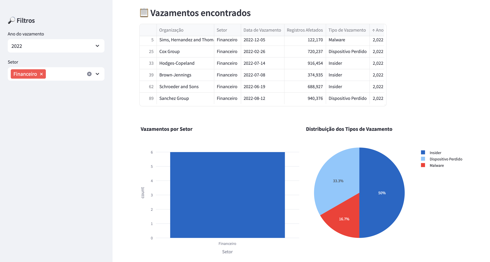

# 🛡️ Data Breach Dashboard

An interactive dashboard built with Streamlit to visualize and analyze simulated data breaches.  
This project demonstrates how data can be structured and displayed to raise awareness about cybersecurity and data privacy.

## 🔍 Features

- Simulated data breaches using Faker
- Interactive filtering by year and sector
- Visualizations with Plotly (Bar and Pie charts)
- Educational focus on the impact of data leaks

## 📁 Project Structure

```
breachwatch/
├── app.py                  # Main Streamlit app
├── modules/
│   ├── data_generator.py   # Simulates fake breach data
│   └── visuals.py          # Plotly visualizations
└── README.md
```

## 🚀 How to Run

1. Clone the repository:
   ```
   git clone https://github.com/Leticia-Ducatti/data-breach-dashboard
   cd data-breach-dashboard
   ```

2. Install dependencies:
   ```
   pip install -r requirements.txt
   ```

3. Run the Streamlit app:
   ```
   streamlit run app.py
   ```

## 📌 Disclaimer

> This dashboard uses **fake, auto-generated data** for educational purposes only.  
> It does not represent real-world breach incidents.

## 💡 Inspiration

Created as a portfolio project to combine **Data Visualization** and **Cybersecurity** concepts using Python.

## 🖼️ Preview



---

Made with 💙 by Letícia Pereira Ducatti
git restore --staged README.md